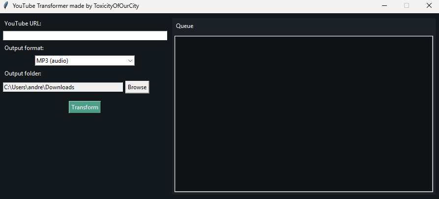
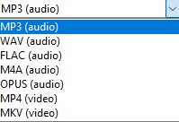

# IMPORTANT NOTICE
** ⚠️ This tool is intended for personal use with content you own or are allowed to download. Please respect copyright laws and YouTube’s Terms of Service. **
---
# YouTube Transformer

Easily download and convert YouTube videos to audio or video files.

---

## What it does

- Convert YouTube videos into **MP3, WAV, FLAC, M4A, OPUS** audio.  
- Save videos as **MP4, MKV** with compatible audio so they play on any Windows media player.  
- Add multiple downloads to a **queue** and watch progress in real-time.

---

## Download & Install

**Install for Windows**  
[**Download Installer Here**](https://github.com/ToxicityOfOurCity/yt-transformer/releases/tag/release)

> The installer bundles the app and FFmpeg, sets up everything automatically, and creates shortcuts for easy access.

---

## How to use

1. Paste a YouTube link.  
2. Pick the output format.  
3. Choose your folder.  
4. Click **Transform** — your file will download and convert automatically.

---

## Screenshots

  
This is the main window of the app.

  
This is how the queue appears while downloading videos (one is mp3 other is mp4).

What format selections there are

---

## Features at a glance

- Simple, clean **GUI** built with Tkinter.  
- Fully **queue-enabled** — add multiple videos or audio files at once.  
- Automatically converts audio in videos to **AAC** for Windows-friendly playback.  
- Works offline after installation — no internet needed to run the app itself.  
- Supports almost any YouTube video or audio stream.

---

## License

**MIT License** — open source and free to use.
